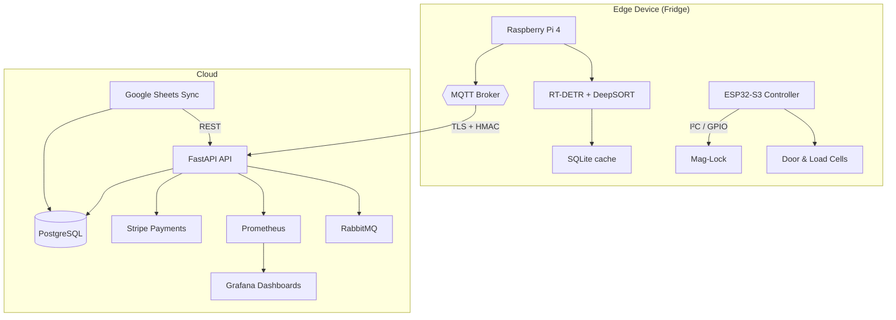
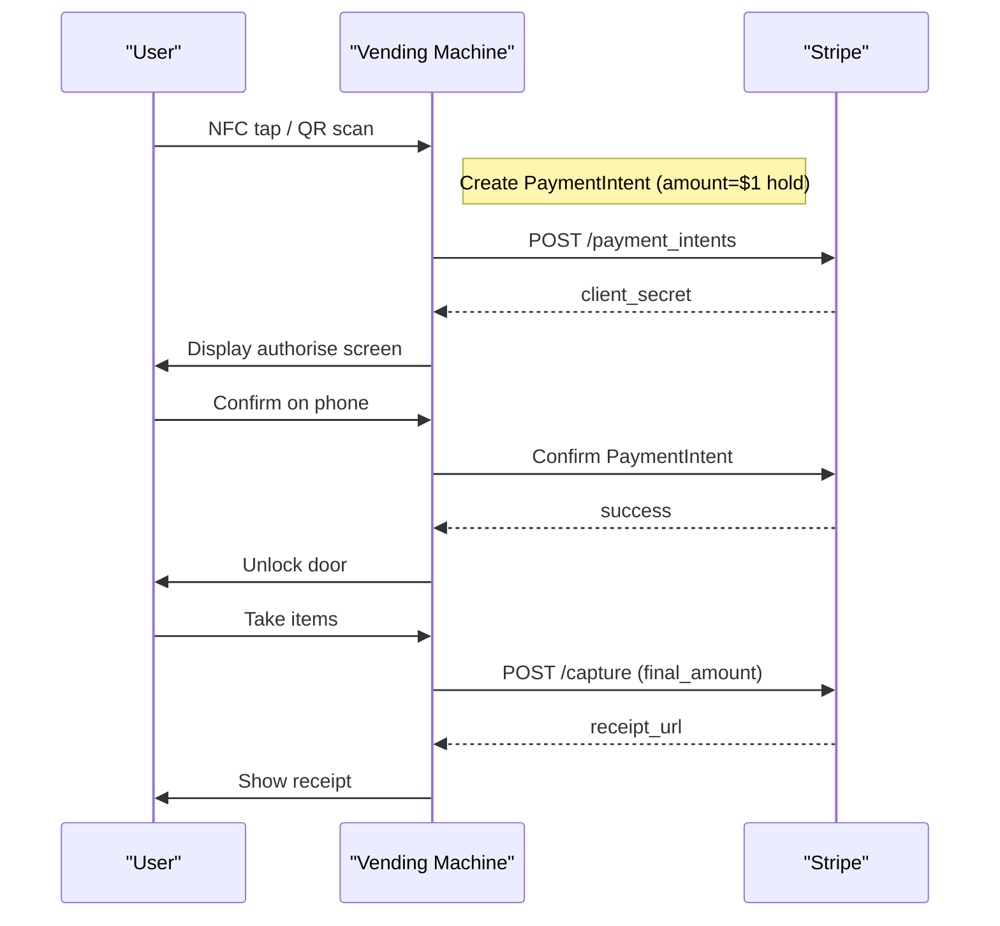

# VisionVend

VisionVend is a Smart Vending Machine Hardware and Software service that lets owner/operators retrofit their product display cases, refrigerators, or freezers to allow unattended sales of their inventory.

## Features

- Retrofit existing display cases for unattended sales  
- Remote unlocking and transaction management  
- Secure payment processing via Stripe  
- Inventory tracking and receipt notifications  
- MQTT-based hardware integration for real-time communication  
- REST API powered by FastAPI  

## Tech Stack

Python 3 · FastAPI · Stripe · MQTT · Prometheus · Grafana · PostgreSQL · Docker · Kubernetes

---

## Platform Architecture – High-Level



---

## Payment Workflow – Sequence



---

## Getting Started

### 1 · Run the full stack with Docker Compose

```bash
git clone https://github.com/Artificial-Me/VisionVend.git
cd VisionVend
cp .env.example .env          # fill in secrets (Stripe, JWT, etc.)
docker compose up -d
```

Access:

• API: <http://localhost:8000/docs>  
• Grafana: <http://localhost:3000> (admin / _your password_)  
• Prometheus: <http://localhost:9090>

### 2 · Edge-device bootstrap (Raspberry Pi)

```bash
# On Pi OS 64-bit Bookworm
curl -sSfL https://get.visionvend.sh | bash
sudo systemctl enable --now visionvend-edge
```

The installer:

1. Flashes the latest VisionVend-Edge image  
2. Configures Wi-Fi / LTE  
3. Registers the machine with the cloud  

---

## API Reference

| Endpoint | Method | Auth | Description |
|----------|--------|------|-------------|
| `/unlock` | POST | JWT / API-Key | Pre-authorise & unlock door |
| `/save-payment` | POST | JWT | Attach Stripe payment method |
| `/metrics` | GET | none | Prometheus metrics |
| `/health` | GET | none | Liveness & readiness |

Example – `/unlock`

```bash
curl -X POST https://api.visionvend.com/unlock \
  -H "Authorization: Bearer $TOKEN" \
  -H "Content-Type: application/json" \
  -d '{"id":"txn_1234"}'
```

---

## Contributing

We ❤️ PRs!

1. Fork → feature branch (`feat/…`)  
2. `make pre-commit` (Black, isort, flake8, mypy)  
3. Add/adjust tests → `pytest -q`  
4. Open PR, fill template, link issue  
5. One reviewer + passing CI = merge 🎉  

---

## License

Released under the **MIT License** – see [`LICENSE`](LICENSE).
© 2025 VisionVend Inc.
