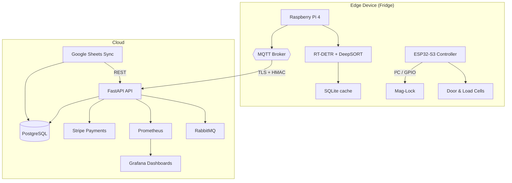
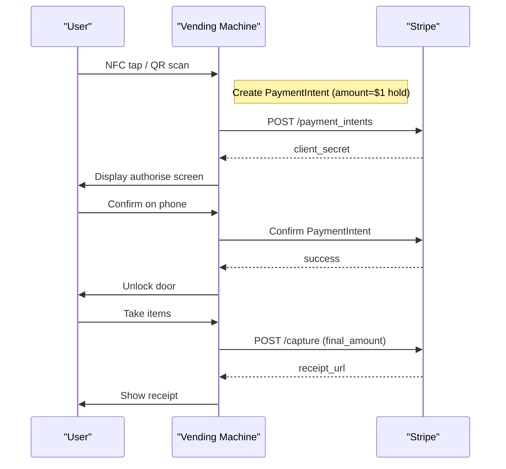

<!-- Logo -->
<p align="center">
  
</p>

<h1 align="center">VisionVend</h1>

<p align="center">
  Enterprise-grade smart-vending platform for unattended retail
</p>

<p align="center">
  <a href="https://github.com/Artificial-Me/VisionVend/actions/workflows/ci.yml">
    
  </a>
  <a href="https://github.com/Artificial-Me/VisionVend/releases">
    
  </a>
  <a href="https://codecov.io/gh/Artificial-Me/VisionVend">
    
  </a>
  <a href="https://hub.docker.com/r/visionvend/api">
    
  </a>
  <a href="LICENSE">
    
  </a>
</p>


# VisionVend

VisionVend is a Smart Vending Machine Hardware and Software service that lets owner/operators retrofit their product display cases, refrigerators, or freezers to allow unattended sales of their inventory.

## Features

- Retrofit existing display cases for unattended sales  
- Remote unlocking and transaction management  
- Secure payment processing via Stripe  
- Inventory tracking and receipt notifications  
- MQTT-based hardware integration for real-time communication  
- REST API powered by FastAPI  

## Tech Stack

Python 3 · FastAPI · Stripe · MQTT · Prometheus · Grafana · PostgreSQL · Docker · Kubernetes

---

## Platform Architecture – High-Level



---

## Payment Workflow – Sequence



---

## Getting Started

### 1 · Run the full stack with Docker Compose

```bash
git clone https://github.com/Artificial-Me/VisionVend.git
cd VisionVend
cp .env.example .env          # fill in secrets (Stripe, JWT, etc.)
docker compose up -d
```

Access:

• API: <http://localhost:8000/docs>  
• Grafana: <http://localhost:3000> (admin / _your password_)  
• Prometheus: <http://localhost:9090>

### 2 · Edge-device bootstrap (Raspberry Pi)

```bash

python helper.py
# Output every 30 s:
# ✅ config.yaml updated (5 SKUs)
# (after a sale) → 🛒 logged transaction tx_9493: [{'sku': 'cola', 'qty': 1}]
```

º The file `config.yaml` is now continuously rewritten — point your existing fridge
code at this path instead of hand-edited YAML.

º If the owner edits price or weight in the Sheet, the fridge picks it up within 30 seconds.
º If the owner adds a brand-new SKU, the fridge knows about it automatically.

────────────────────────────────────────
PART 5 — Change ONE place in the fridge code
────────────────────────────────────────
Where you currently “finalise” a purchase, add:

```python
import requests, json
...
payload = {
"transaction_id": txn_id,             # whatever id you use
"items"         : [{"sku":sku, "qty":qty} for sku,qty in items_dict.items()]
}
try:
    requests.post("http://<PC_running_helper>:5001/transaction",
                  data=json.dumps(payload),
                  headers={"Content-Type":"application/json"},
                  timeout=2)
except Exception as e:
print("⚠️  could not log sale:", e)
```

That is literally everything: stock is deducted, charts update, low-stock cells turn red, and the YAML used by the fridge stays current.

────────────────────────────────────────
PART 6 — Optional extras in 1-line each
────────────────────────────────────────
• Email/SMS a restock alert → in the Sheet use `=IF(I2<5,"🔴 restock", "")` and add AppSheet workflow “Send mail when column changes to 🔴 restock”.

• Owner wants an “export to CSV” → File → Download → CSV (built-in).

• More fancy dashboards → Data → Connect to Looker Studio → pick the same Sheet.

────────────────────────────────────────
Recap
────────────────────────────────────────
Non-technical workflow

1. They open the Sheet (or AppSheet link) to add a product row or submit a restock form.
2. They close the fridge door; your firmware calls /transaction.
3. Sheet auto-updates stock & charts; helper.py rewrites config.yaml.

## Ultra-fast product training (dual-cam, hand-aware, frictionless)

### Cross-platform prototyping (Windows/Mac/Linux)

You can use VisionVend's dataset creation and mock-purchase logging on any OS, even without a Raspberry Pi or hardware. This is ideal for prototyping with GoPro or webcam footage.

#### 1. Auto-label your GoPro or webcam video

- Run the auto-labeler on a video file:

  ```bash
  python -m VisionVend.raspberry_pi.video_autolabel --sku cola --video path/to/video.mp4 --every 5
  ```

  - `--sku` is the product name.
  - `--video` is your recorded video file (e.g., from GoPro).
  - `--every` processes every Nth frame (default: 5).
- Labeled images and YOLO-format labels will appear in your configured dataset directory.

#### 2. Log mock-purchases (no Stripe, no hardware required)

- Log a mock-purchase (e.g., when you "remove" an item from your fridge):

  ```bash
  python -m VisionVend.raspberry_pi.mock_purchase --sku cola --user testuser
  ```

  - This appends a line to `/sd/mock_transactions.txt` with the timestamp, user, and SKU.

You can now build datasets and simulate purchases entirely on your laptop or desktop!

---

VisionVend now supports a frictionless, robust workflow for owners/operators to add new products and keep the model up-to-date with minimal effort.

### How to train the system on a new product

1. **Add SKU row:** Open the Google Sheet and insert a new row with SKU, price, and weight.
2. **Restock capture:** Open the fridge door, press the blue RESTOCK-TRAIN button. Hold ONE product under the opening (top/bottom camera views) for ~5 seconds until the light flashes green.
3. **Retrain:** When you've added 2-3 new items, press "Retrain" in the dashboard, or wait for the nightly automatic retrain (runs if ≥60 new frames are available).

- The Pi captures ~120 dual-view images per SKU, with the hand automatically cropped out of the bounding box using MediaPipe.
- All hardware and capture parameters are configurable in `config/config.yaml` under the `training` section.
- The system writes logs to `/sd/autolabel_log.jsonl` for troubleshooting and auditing.

#### Calibration (optional)

- Run the `capture.py` calibration mode to auto-tune background subtraction and hand detection for your lighting.
- All thresholds (area, hand IoU, stable frames, timeouts, LED pins/colors, etc.) are set in the config file.

#### Troubleshooting

- **No green flash:** Check hand-IoU threshold, ensure product is visible to both cameras.
- **Not enough frames:** Increase `stable_frames` or lower `min_area` in the config.
- **LED stays red:** Inspect `/sd/autolabel_log.jsonl` for error messages.

See `VisionVend/raspberry_pi/capture.py` and `VisionVend/raspberry_pi/tracker.py` for implementation details.


---

**System Overview**

**Key Features**

* **Battery-Powered**: Small Li-Po batteries (500mAh for controller, 2000mAh for cameras) with USB-C charging, eliminating 12V rail dependency.
* **Dual-Camera Object Detection**: Two Raspberry Pi Camera Module 3 units, processed locally on a Raspberry Pi 4 using Hugging Face DETR, with videos stored on an SD card for training.
* **Weight Sensors as Redundancy**: Four load cells (HX711) provide backup inventory tracking, reducing errors from similar-weight items.
* **Passive NFC/QR Interface**: NTAG 215 or QR code sticker launches a PWA for unlock and payment, requiring only one tap/scan.
* **Low-Cost LTE**: SIM7080G CAT-M/NB-IoT module (~$22) for payment confirmations, minimizing data usage.
* **Delayed Payment Capture**: Stripe Payment Intent pre-authorizes on tap, captures only after door closure if items are removed.
* **Fail-Secure Lock**: 12V mag-lock with supercapacitor for re-locking during power loss.
* **Robust Feedback**: OLED, RGB LED, and buzzer for clear status updates.
* **Simple Installation**: Adhesive mounting, no case modifications, ideal for fridges/freezers.

---

**Improvements Over Previous Designs**

1. **Battery Power for Simplicity**:
   * **Solution**: Small Li-Po batteries (500mAh for ESP32-S3, 2000mAh for Raspberry Pi 4) with TP4056 USB-C chargers, providing ~12–24 hours of operation per charge.
   * **Benefit**: Eliminates 12V rail integration, making installation plug-and-play for customers who prefer minimal setup (e.g., no electrician needed for fridges/freezers).
2. **Local Object Detection**:
   * **Solution**: Raspberry Pi 4 (4GB) runs Hugging Face DETR locally, processing dual-camera feeds in real-time, storing videos on a 32GB SD card for later analysis/training.
   * **Benefit**: Removes latency from streaming to the cloud, reduces data costs, and enables offline operation except for payment confirmations.
3. **Dual-Camera + Weight Redundancy**:
   * **Solution**: Two Camera Module 3 units for robust object detection, backed by load cells to catch errors (e.g., similar-weight items like a 355g cola vs. 350g soda).
   * **Benefit**: Ensures high accuracy without sole reliance on weight sensors, addressing your concern about error-proneness.
4. **Cost-Effective LTE**:
   * **Solution**: SIM7080G CAT-M/NB-IoT module (**$22) for low-bandwidth payment confirmations (**1KB per transaction), avoiding the $460 5G hub.
   * **Benefit**: Reduces recurring data costs to ~$2–$5/month (or less with pay-per-use plans), sufficient for Stripe API calls.
5. **Enhanced Error Handling**:
   * **Solution**: Cross-reference camera and weight data to flag discrepancies, storing flagged videos for manual review or ML retraining.
   * **Benefit**: Minimizes false positives/negatives, improving reliability for similar-weight SKUs.
6. **Freezer Compatibility**:
   * **Solution**: Use low-temperature-rated Li-Po batteries, conformal coating, and anti-fog lenses for cameras to operate at -20°C.
   * **Benefit**: Ensures reliability in fridges/freezers without hardware modifications.

---

**Process Flow and Logic**

**1. Idle State**

* **Display Case**: Locked (fail-secure mag-lock unpowered).
* **ESP32-S3**: Deep sleep, waking every 250ms to check Hall sensor (door status) and LTE keep-alive.
* **Raspberry Pi 4**: Low-power mode, cameras off, monitoring PIR sensor for motion.
* **Load Cells**: Powered off.
* **Feedback**: OLED off or dim (“Tap to Unlock”), RGB LED off.
* **Power**: ~20µA (ESP32), ~100mA idle (Pi 4), from 500mAh/2000mAh Li-Po batteries.

**2. Customer Approaches**

* **Trigger**: Sees “Tap Phone Here” NFC tag (NTAG 215) or QR code sticker.
* **Action**: Taps phone (iOS 15+, Android 12+) or scans QR, launching PWA.
* **PWA**:
  * **First-time: Sign-in, Stripe payment setup (stored).**
  * **Returning: Loads instantly, no clicks.**
  * **Sends HTTPS **/unlock?id=abc123** to server via LTE.**
* **Feedback**: OLED: “Tap to Unlock,” RGB LED: Green (optional VL53L1X ToF sensor brightens on approach).

**3. Unlock Request**

* **Server**:
  * **Verifies customer (JWT/session).**
  * **Creates Stripe Payment Intent (**amount=100**, **capture_method='manual'**, **automatic_payment_methods** enabled).**
  * **Publishes MQTT **case/123/cmd: unlock:abc123** with HMAC-SHA256.**
* **ESP32-S3**:
  * **Validates HMAC, powers MOSFET to unlock mag-lock.**
  * **Signals Raspberry Pi 4 to capture baseline inventory (cameras + load cells).**
* **Feedback**:
  * **OLED: “Door Unlocked”**
  * **RGB LED: Flashes blue**
  * **Buzzer: Chirps**
  * **Optional voice (DFPlayer Mini): “Door is now unlocked”**

**4. Customer Accesses Case**

* **Door Open**: Mag-lock energized until door closes or 10-second timeout.
* **Inventory Monitoring**:
  * **Cameras: Record video to SD card, process real-time with DETR on Pi 4.**
  * **Load Cells: Sample weight at 80Hz.**
* **Timeout**: If door open >10 seconds, lock re-engages, OLED: “Tap Again,” LED: Red.

**5. Customer Removes Items**

* **Detection**:
  * **Cameras: DETR identifies removed items (e.g., cola, chips).**
  * **Load Cells: Track Δmass (e.g., 355g for cola).**
  * **Cross-reference: Flag discrepancies (e.g., camera detects cola, weight suggests chips).**
* **Storage**: Video saved to SD card with timestamp and transaction ID.

**6. Door Closes**

* **Detection**: Hall sensor triggers on closure.
* **Re-Locking**: MOSFET de-energized, lock engages (supercapacitor ensures power).
* **Inventory Finalization**:
  * **Cameras: Capture final frame, confirm removed items via DETR.**
  * **Load Cells: Record final weight, calculate Δmass.**
  * **Resolution: Use camera data as primary, weight as backup; flag discrepancies for SD card review.**
* **Server Processing**:
  * **ESP32 sends Δmass and transaction ID via LTE/MQTT.**
  * **Pi 4 sends detected items (if discrepancy, includes snapshot).**
  * **Server:**
    * **Maps items to prices (e.g., cola: $2).**
    * **If no items removed: Cancel Payment Intent.**
    * **If items removed: Modify amount, capture payment.**
    * **Sends Web Push receipt to PWA.**
* **Feedback**:
  * **OLED: “No Charge” or “Items: [list], Total: $[amount]”**
  * **RGB LED: Blue (0.5s), then off**
  * **Buzzer: Chirps**
  * **PWA: Displays receipt**

**7. Error Handling**

* **Payment Failure**: PWA/OLED: “Try Another Card,” LED: Red.
* **Inventory Discrepancy**: Flag video for review, use weight data as fallback.
* **Power Loss**: Supercapacitor ensures re-locking and MQTT send.
* **Network Failure**: Buffer MQTT messages, retry when LTE reconnects.

**To create a Progressive Web App (PWA) for your retail display case system that delivers a seamless “one-tap-to-open / charge-only-if-removed” experience, the PWA must be lightweight, intuitive, and responsive, ensuring compatibility with iOS 15+ and Android 12+ devices for NFC/QR-triggered interactions. The PWA will handle user authentication, Stripe payment setup, unlock requests, and transaction feedback (e.g., running bill, receipt), complementing the on-device feedback (OLED, RGB LED, buzzer). Below, I’ll outline the PWA design, including user flow, UI/UX, technical architecture, and implementation details, tailored to your system’s requirements for battery-powered, dual-camera, Raspberry Pi 4-based object detection with LTE connectivity (SIM7080G) for payment confirmations.**

---

**PWA Design Goals**

1. **Frictionless Experience**:
   * **Launch instantly via NFC tap (NTAG 215) or QR scan.**
   * **Minimize user input: one-time sign-in, stored payment methods, no clicks for returning users.**
   * **Display unlock status, running bill, and receipt in <2 seconds.**
2. **Lightweight and Offline-Capable**:
   * **Bundle size: ~100KB to ensure fast loading over LTE.**
   * **Cache assets (HTML, CSS, JS) for offline access, queueing payment confirmations if LTE is unavailable.**
3. **Responsive and Accessible**:
   * **Support small screens (e.g., 320x480) to large (1920x1080).**
   * **Follow WCAG 2.1 guidelines (e.g., high-contrast text, screen reader support).**
   * **Multi-language support (e.g., English, Spanish).**
4. **Secure and Reliable**:
   * **Use HTTPS and JWT for authentication.**
   * **Integrate Stripe for secure payment pre-authorization and capture.**
   * **Handle network failures gracefully with retries.**
5. **Feedback Integration**:
   * **Mirror on-device OLED messages (e.g., “Door Unlocked,” “Items: Cola, Total: $2”).**
   * **Provide Web Push notifications for receipts and no-charge confirmations.**

---

**User Flow**

1. **Initial Interaction**:
   * **Customer taps NFC tag or scans QR code on the display case.**
   * **Phone launches PWA (via browser or installed app) in <1 second.**
   * **First-Time Users**:
     * **PWA prompts sign-in (email or Google/Apple SSO).**
     * **User adds payment method via Stripe Elements (card, Apple Pay, Google Pay).**
     * **Payment method stored securely for future visits.**
   * **Returning Users**: PWA loads instantly, auto-authenticates via JWT.
2. **Unlock Request**:
   * **PWA sends HTTPS **/unlock?id=abc123** to server via LTE.**
   * **Displays “Unlocking...” with a spinner.**
   * **On success: Shows “Door Unlocked” (mirrors OLED).**
   * **On failure (e.g., payment declined): Shows “Try Another Card.”**
3. **Transaction Monitoring**:
   * **Displays running bill as items are detected (via WebSocket or polling, optional).**
   * **Updates dynamically if customer removes/adds items (e.g., “Cola: $2”).**
4. **Completion**:
   * **On door closure (detected by Hall sensor), server sends Web Push notification:**
     * **No items removed**: “No Charge.”
     * **Items removed**: “Items: Cola, Total: $2.”
   * **PWA displays receipt with itemized list, total, and timestamp.**
   * **Option to save receipt (PDF download or email).**
5. **Error Handling**:
   * **Network failure: Queues requests, shows “Reconnecting...”**
   * **Payment error: Prompts retry with alternative payment method.**
   * **Timeout (door open >10s): Shows “Tap Again to Continue.”**

---

**UI/UX Design**

**Screens**

1. **Home Screen (Launch)**:
   * **Content**:
     * **Header: “Tap to Unlock” (bold, 24px, centered).**
     * **Logo/icon (your brand, 64x64px).**
     * **Button: “Scan QR Code” (for non-NFC devices, 48px height, blue).**
     * **Status: “Ready to Unlock” (16px, gray).**
   * **Design**:
     * **Background: White (#FFFFFF).**
     * **Text: Black (#000000, contrast ratio >4.5:1).**
     * **Button: Blue (#007BFF), white text, rounded (8px).**
   * **Behavior**:
     * **NFC tap auto-triggers unlock.**
     * **QR scan opens camera, reads code, triggers unlock.**
2. **Sign-In Screen** (First-Time Only)**:
   * **Content**:
     * **Input: Email or SSO buttons (Google, Apple).**
     * **Button: “Continue” (48px, blue).**
     * **Link: “Privacy Policy” (14px, blue).**
   * **Design**:
     * **Minimal form, centered, 80% screen width.**
     * **SSO buttons: Icon + text (e.g., “Sign in with Google”).**
   * **Behavior**:
     * **Validates email, sends OTP if needed.**
     * **SSO redirects to provider, returns JWT.**
3. **Payment Setup Screen** (First-Time Only)**:
   * **Content**:
     * **Stripe Elements: Card input (number, expiry, CVC).**
     * **Buttons: Apple Pay/Google Pay (if available).**
     * **Button: “Save Payment” (48px, blue).**
   * **Design**:
     * **Secure input fields, green checkmark on valid input.**
     * **Payment buttons: Branded (Apple Pay black, Google Pay white).**
   * **Behavior**:
     * **Stores payment method in Stripe Customer object.**
     * **Redirects to Home Screen.**
4. **Unlocking Screen**:
   * **Content**:
     * **Spinner: Animated (blue, 32px).**
     * **Status: “Unlocking...” (20px, black).**
     * **Cancel: “Cancel” (14px, red, bottom).**
   * **Design**:
     * **Full-screen, centered.**
     * **Spinner pulses for activity.**
   * **Behavior**:
     * **Updates to “Door Unlocked” on success (<2s).**
     * **Shows error on failure (e.g., “Payment Declined”).**
5. **Transaction Screen**:
   * **Content**:
     * **List: Running bill (e.g., “Cola: $2”).**
     * **Total: “Total: $2” (20px, bold).**
     * **Status: “Door Open” (16px, gray).**
   * **Design**:
     * **List: Table format, alternating row colors (#F9F9F9, #FFFFFF).**
     * **Total: Green (#28A745) if items added.**
   * **Behavior**:
     * **Updates dynamically (optional, via WebSocket).**
     * **Transitions to Receipt Screen on door closure.**
6. **Receipt Screen**:
   * **Content**:
     * **Header: “Thank You!” (24px, bold).**
     * **List: Itemized (e.g., “Cola: $2”).**
     * **Total: “Total: $2” (20px, bold).**
     * **Timestamp: “Apr 27, 2025, 14:30” (14px, gray).**
     * **Buttons: “Save Receipt” (PDF), “Email Receipt” (48px, blue).**
   * **Design**:
     * **Clean, centered, green checkmark for completion.**
     * **Buttons: Blue, rounded, full-width.**
   * **Behavior**:
     * **Web Push notification mirrors receipt.**
     * **PDF/email options save/send transaction details.**

**Accessibility**

* **Contrast**: Text/background ratio >4.5:1 (WCAG 2.1).
* **Screen Reader**: ARIA labels (e.g., **aria-label="Unlock button"**).
* **Touch Targets**: Minimum 48x48px for buttons.
* **Languages**: English/Spanish, toggle in settings (stored in localStorage).

**Animations**

* **Spinner**: 1s rotation for “Unlocking...”.
* **Transitions**: 0.3s fade for screen changes.
* **Feedback**: Pulse effect on status updates (e.g., “Door Unlocked”).

---

**Technical Architecture**

**Framework and Tools**

* **Framework**: React (with Vite for bundling, ~100KB).
* **CSS**: Tailwind CSS (minified, ~10KB) for responsive styling.
* **Libraries**:
  * **Stripe.js: Payment integration.**
  * **Web Push API: Notifications.**
  * **NDEFReader API: NFC tag reading.**
  * **JWT-decode: Authentication.**
* **Build**: Vite, minifies JS/CSS, tree-shakes unused code.
* **Hosting**: Vercel or Netlify for HTTPS, CDN, and auto-scaling.

**File Structure**

```text
pwa/
├── public/
│   ├── index.html
│   ├── manifest.json
│   ├── icons/
│   │   ├── icon-192.png
│   │   ├── icon-512.png
├── src/
│   ├── components/
│   │   ├── Home.js
│   │   ├── SignIn.js
│   │   ├── PaymentSetup.js
│   │   ├── Unlocking.js
│   │   ├── Transaction.js
│   │   ├── Receipt.js
│   ├── styles/
│   │   ├── tailwind.css
│   ├── App.js
│   ├── main.js
├── package.json
├── vite.config.js
=======
# On Pi OS 64-bit Bookworm
curl -sSfL https://get.visionvend.sh | bash
sudo systemctl enable --now visionvend-edge

```

The installer:

1. Flashes the latest VisionVend-Edge image  
2. Configures Wi-Fi / LTE  
3. Registers the machine with the cloud  

---

## API Reference

| Endpoint | Method | Auth | Description |
|----------|--------|------|-------------|
| `/unlock` | POST | JWT / API-Key | Pre-authorise & unlock door |
| `/save-payment` | POST | JWT | Attach Stripe payment method |
| `/metrics` | GET | none | Prometheus metrics |
| `/health` | GET | none | Liveness & readiness |

Example – `/unlock`

```bash
curl -X POST https://api.visionvend.com/unlock \
  -H "Authorization: Bearer $TOKEN" \
  -H "Content-Type: application/json" \
  -d '{"id":"txn_1234"}'
```

---

## Contributing

We ❤️ PRs!

1. Fork → feature branch (`feat/…`)  
2. `make pre-commit` (Black, isort, flake8, mypy)  
3. Add/adjust tests → `pytest -q`  
4. Open PR, fill template, link issue  
5. One reviewer + passing CI = merge 🎉  

---

## License

Released under the **MIT License** – see [`LICENSE`](LICENSE).
© 2025 VisionVend Inc.
