# VisionVend


<<<<<<< HEAD
## Table of Contents

- [Overview](#overview)
- [System Components](#system-components)
  - [Vending Machine Chassis](#vending-machine-chassis)
  - [Control Unit](#control-unit)
  - [Computer Vision System](#computer-vision-system)
  - [User Interaction &amp; Payment](#user-interaction--payment)
  - [Door Mechanism](#door-mechanism)
  - [Network Connectivity](#network-connectivity)
- [Software Architecture](#software-architecture)
- [Detailed Workflow](#detailed-workflow)
- [Technical Considerations](#technical-considerations)

## Overview

<details>
<summary>Click to expand overview</summary>

VisionVend is a Smart Vending Machine Hardware and Software service that lets owner/operators retrofit their product display cases, refrigerators, or freezers to allow unattended sales of their inventory.

</details>

## Architecture Diagrams

### 1. Detailed System Architecture (Color-Coded)


### 2. Detailed Payment Workflow (Color-Coded)

```mermaid
sequenceDiagram
    participant User as User👤
    participant Machine as Vending Machine🤖
    participant Stripe as Stripe💳
  
    %% Initialization
    User->>Machine: NFC Tap/QR Scan
    Note right of Machine: Payment Intent Created
    Machine->>Stripe: POST /payment_intents<br>amount: $1.00 (pre-auth)
    Stripe-->>Machine: client_secret
  
    %% Authorization
    Machine->>User: Show Payment Authorization
    User->>Machine: Confirm via Phone
    Machine->>Stripe: Confirm Payment
    Stripe-->>Machine: success: true
  
    %% Fulfillment
    Machine->>User: Unlock Door
    User->>Machine: Take Items
    Machine->>Stripe: POST /capture<br>final_amount
    Stripe-->>Machine: receipt_url
  
    %% Completion
    Machine->>User: Show Success & Receipt
```



## System Components

### Vending Machine Chassis

<details>
<summary>Click to view vending machine chassis</summary>

* **Transparent display case (door).**
* **Shelves for products.**
* **Internal lighting.**

</details>

### Control Unit

<details>
<summary>Click to view control unit</summary>

* **Microcontroller/SBC (Single Board Computer):** **Raspberry Pi 4/5, NVIDIA Jetson Nano (excellent for vision tasks), or a more industrial-grade equivalent.**
* **Responsibilities:** **Orchestrates all components, runs the main application logic, network communication.**

</details>

### Computer Vision System

<details>
<summary>Click to view computer vision system</summary>

* **Camera:** **High-resolution camera(s) positioned to have a clear, unobstructed view of all products. Multiple cameras might be needed for full coverage without blind spots, especially in larger machines.**
* **D-FINE & DeepSORT Software:**

  * **D-FINE:** **This would be your primary object detection model. It needs to be trained (or fine-tuned) to accurately detect and classify each product you stock. Each product type would be a distinct class.**
  * **DeepSORT:** **This algorithm takes the detections from D-FINE and assigns a unique ID to each detected product instance, tracking it across frames even with minor occlusions or movement.**
* **Processing:** **Likely done on the SBC (if powerful enough, like a Jetson) or potentially offloaded to a local edge server if multiple machines are co-located.**

</details>

### User Interaction & Payment

<details>
<summary>Click to view user interaction & payment</summary>

* **NFC Reader:** **Connected to the control unit (e.g., via USB or SPI/I2C).**
* **Small Display (Optional but Recommended):** **To provide user feedback (e.g., "Tap phone to start," "Processing," "Thank you").**
* **Stripe API Integration:** **Software module to communicate with Stripe.**

</details>

### Door Mechanism

<details>
<summary>Click to view door mechanism</summary>

* **Electronic Lock:** **Solenoid lock or similar, controlled by the SBC.**
* **Door Sensor:** **Magnetic reed switch or IR sensor to detect if the door is open or closed.**

</details>

### Network Connectivity

<details>
<summary>Click to view network connectivity</summary>

* **Wi-Fi or Ethernet for communication with Stripe API and potentially a backend server for inventory/management.**

</details>

## Software Architecture

<details>
<summary>Click to view software architecture</summary>

* **Main Application (e.g., Python-based):**

  * **State machine to manage the vending process.**
  * **Coordinates all other modules.**
* **NFC Reader Module:**

  * **Listens for NFC taps.**
  * **Extracts necessary information (could be a pre-registered token or just an indicator to initiate with the user's phone app).**
* **Stripe Integration Module:**

  * **Handles creation of Payment Intents.**
  * **Handles capturing/confirming Payment Intents.**
  * **Securely stores Stripe API keys (using environment variables or a secrets manager).**
* **Computer Vision Module:**

  * **Interfaces with the camera(s).**
  * **Runs D-FINE for object detection on each frame (or periodically).**
  * **Feeds detections to DeepSORT to get tracked product instances with unique IDs.**
  * **Core Logic:**

    * **establish_baseline_inventory()**: When the door is locked and system is idle/ready, it takes a snapshot of all visible and tracked products. Each tracked item (with its DeepSORT ID and D-FINE class) is noted with its location/shelf.
    * **detect_removed_items(baseline_inventory, current_inventory_after_door_close)**: Compares the baseline with the state after the door closes to identify missing DeepSORT IDs.
* **Door Control Module:**

  * **unlock_door()**
  * **lock_door()**
  * **get_door_status()**
* **Inventory & Pricing Database:**

  * **A local database (e.g., SQLite) or configuration file mapping:**

    * **D-FINE Product Class (e.g., "coke_can", "lays_chips_blue") -> Product Name, Price, SKU.**
  * **This is used to calculate the total charge.**

</details>

## Detailed Workflow

<details>
<summary>Click to view detailed workflow</summary>

* **Idle State:**

  * **Door is locked.**
  * **Vision system might periodically scan to ensure inventory matches last known state (optional self-check).**
  * **NFC reader is active.**
  * **Display shows "Tap phone to start."**
* **Transaction Initiation:**

  * **Customer taps their phone (with an NFC-enabled payment app like Apple Pay, Google Wallet, or a dedicated store app) on the NFC reader.**
  * **NFC module detects the tap.**
* **Stripe Payment Intent Creation:**

  * **The SBC sends a request to Stripe's API to create a Payment Intent.**

    * **amount**: Initially, this could be a nominal amount (e.g., $0.01 or $1.00) for pre-authorization, or you might pre-authorize a higher "hold" amount (e.g., $20) if your products are expensive. Stripe's "deferred payment" or "setup intents" for future payments might also be relevant depending on exact flow.
    * **currency**: e.g., "usd".
    * **payment_method_types**: ['card'] (or specific ones supported via NFC).
    * **capture_method**: 'manual' (crucial, as you'll capture later).
  * **Stripe responds with a** **client_secret** **for the Payment Intent.**
  * **The system needs to handle the confirmation flow on the customer's phone if required by Stripe for the payment method presented via NFC. Often, for tap-to-pay, this is seamless.**
* **Door Unlock & Inventory Baseline:**

  * **If Payment Intent is successfully initiated/authorized:**

    * **The vision system performs a** **establish_baseline_inventory()** **scan:**

      * **D-FINE detects all products.**
      * **DeepSORT tracks them and assigns IDs.**
      * **This state (list of tracked product IDs, their classes, and possibly rough locations) is stored in memory.**
    * **The SBC sends a signal to** **unlock_door()**.
    * **Display shows "Door unlocked. Please take your items."**
  * **If Payment Intent fails:**

    * **Display shows "Payment authorization failed. Please try again."**
    * **Door remains locked.**
* **Product Selection:**

  * **Customer opens the door.**
  * **Door sensor registers "door open."**
  * **The vision system** **could** **continuously monitor changes, but the key analysis happens** **after** **the door is confirmed closed and locked**.
* **Door Close & Product Detection:**

  * **Customer takes desired product(s) and closes the door.**
  * **Door sensor registers "door closed."**
  * **The SBC immediately sends a signal to** **lock_door()**.
* **Calculate Charge:**

  * **The vision system performs a new scan to get the** **current_inventory_after_door_close**.
  * **The** **detect_removed_items()** **function compares the** **baseline_inventory** **with** **current_inventory_after_door_close**.

    * **For each product ID present in** **baseline_inventory** **but** **missing** **in** **current_inventory_after_door_close**, it's considered taken.
  * **The system looks up the D-FINE class of each removed item in the Inventory & Pricing Database to get its price.**
  * **The total** **final_amount** **is calculated.**
* **Finalize Payment (Stripe Capture):**

  * **The SBC sends a request to Stripe's API to capture the Payment Intent:**

    * **Using the** **payment_intent_id** **from step 3.**
    * **Specifying the** **amount_to_capture: final_amount** **(in cents).**
  * **If Capture is Successful:**

    * **Display shows "Thank you! Payment successful."**
    * **(Optional) Send an e-receipt if customer email/phone is linked (e.g., via a customer account if they used a store app).**
    * **Update backend inventory records.**
  * **If Capture Fails (e.g., insufficient funds, fraud block):**

    * **This is a critical failure case.**
    * **Log the incident extensively: customer identifier (if available from NFC/app), items taken, timestamp.**
    * **Display shows "Payment failed. Please contact support."**
    * **Flag the transaction for manual review/follow-up. This might involve trying to charge again later or absorbing the loss.**
* **Return to Idle State.**

</details>

## Technical Considerations

### Speed: Real-time Vision Processing

<details>
<summary>Click to view technical considerations</summary>

* **Hardware:** **NVIDIA Jetson (Orin Nano, Orin NX, AGX Orin) is highly recommended for edge AI, especially for DETR-based models like D-FINE. Raspberry Pi 5 might handle very lightweight detection models, but D-FINE (especially larger variants) will struggle.**
* **Model Choice:** **D-FINE offers different sizes (N, S, M, L, X). Start with the smallest (D-FINE-N) and benchmark its speed and accuracy on your target hardware.**

  * **The D-FINE README provides latency on a T4 GPU (e.g., D-FINE-N @ 2.12ms). Expect significantly higher latency on an edge device. Aim for a total processing time (detection + tracking + logic) of a few seconds at most after the door closes.**
* **Optimization:**

  * **TensorRT:** **Essential for NVIDIA hardware. The D-FINE README includes steps for exporting to ONNX and then TensorRT. This can provide significant speedups.**
  * **Frame Rate:** **You don't need to process at 30 FPS. For the "before" and "after" scans, a few good quality frames are sufficient. During the "door open" phase, you might not need to process every frame unless you're trying to do live tracking of the hand (which is much more complex).**
  * **Resolution:** **Use the lowest resolution that still gives good detection accuracy.**
* **Benchmarking:**

  * **Deploy D-FINE (e.g., D-FINE-N) + chosen tracker on your target SBC.**
  * **Measure time for:** **establish_baseline_inventory()** **and** **detect_removed_items()**.
  * **If too slow, consider a more powerful Jetson, a smaller D-FINE variant (if not already using N), or further model quantization (e.g., INT8 with TensorRT, if accuracy permits).**

</details>

### Initial Inventory Setup & Restocking:

  **Your** **helper.py** **script using Google Sheets is a great foundation for managing product definitions (SKU, price).**

  **"Restock Mode" Integrated with Vision:**

* **Operator Initiates "Restock Mode"** **(e.g., via an admin button/interface).**
* **System State:** **Door unlocks. Vision system is in a "learning" or "confirming" state.**
* **Operator Action & System Response (Iterative):**

  * **Operator places a** **single type** **of new item (e.g., 5 cans of Coke).**
  * **Operator indicates "item(s) placed" (e.g., presses a button).**
  * **System captures images/short video.**
  * **Attempt Auto-ID:** **D-FINE tries to detect and classify.**

    * **If Confident & Known:** **"Detected 5 x 'coke_can'. Correct?" -> Operator confirms.**
    * **If Low Confidence or Unknown:** **"Unknown item. Please identify:"**

      * **Operator selects from a list (pulled from Google Sheet via** **helper.py**).
      * **OR: Operator types in SKU.**
      * **System associates the visual features of these newly placed items with the provided SKU for future reference or to contribute to the "Restock-to-Train" pipeline.**
* **The** **baseline_inventory** **is updated with these confirmed items and their tracked IDs.**
* **Operator Finishes Restocking.** **System reverts to normal operation.**

  **This mode combines manual confirmation with the vision system's capabilities, ensuring the machine's internal state accurately reflects its contents. The data gathered here (images of newly stocked items with confirmed labels) is gold for your "Restock-to-Train" pipeline.**

### Error Handling:

  **Continue to prioritize:**

* **Network Timeouts/Errors:** **Retry mechanisms for Stripe calls, graceful degradation if offline (e.g., log transaction locally and sync later, though this is risky for payments).**
* **Stripe API Errors:** **Specific handling for different error codes (e.g., card declined, insufficient funds, fraud).**
* **Sensor Failures:** **Door sensor stuck open/closed. Camera feed lost.**
* **Vision System Errors:** **Model fails to load, tracker crashes. Log extensively. Fallback modes (e.g., "Out of Order") if critical components fail.**

### Security:

* **Physical:** **Fail-secure electromagnetic latch is good.**
* **Stripe API Keys:** **Store them as environment variables on the SBC or use a secrets management service if your setup is more complex.** **Never hardcode them.** **Your** **helper.py** **uses** **.env**, which is good practice.
* **Local Data:** **If sensitive transaction data is cached locally, ensure it's encrypted.**
* **System Updates:** **Secure mechanism for updating the software on the SBC.**

  **This detailed approach, leveraging the strengths of D-FINE/DEIM for detection and a robust tracker like ByteTrack, combined with your "Restock-to-Train" vision and Google Sheets integration, sets a strong foundation for a truly smart vending machine. The most challenging parts will be the robustness of the vision system in diverse real-world scenarios (lighting variations despite internal consistency, odd product placements, very similar items) and the seamlessness of the "Restock-to-Train" data pipeline.**

# Inventory Management with Google Sheets & Python Helper

## Overview

This solution provides a simple, spreadsheet-based inventory system for vending/fridge owners. Owners interact only with Google Sheets, Forms, and optionally AppSheet—no software installation required. A lightweight Python script automates syncing and sales logging.

---

## 1. Owner Workflow

### A. Google Sheet ("Back Office")

- **Products Tab**
  - Columns: SKU | Name | Price ($) | Weight (g) | Current Stock | Photo URL
  - Add/edit products just like in Excel.
  - Conditional formatting highlights low stock.
- **Restock/Adjust Log**
  - Filled automatically via a Google Form when restocking.
- **Sales Log**
  - Updated by the helper script when sales are recorded.
- **Charts Tab**
  - Pre-built charts show sales trends and stock levels. No setup required.

### B. Google Form (for Restocking)

- Mobile-friendly, opens in any browser.
- Two fields:
  1. Product (dropdown from Products tab)
  2. Quantity loaded/removed
- Submissions update the Restock log and recalculate stock automatically.

### C. Optional: AppSheet Mobile App

- In Google Sheets: Extensions → AppSheet → Create an app.
- Instantly generates a mobile web app for inventory and restocking.
- No installation—just save the link to the home screen.

---

## 2. Background Automation (Technical Setup)

A simple Python script runs on any always-on PC or Raspberry Pi:

1. **Syncs Product Data**
   - Every 30 seconds, fetches the Products tab via the Google Sheets API (using gspread).
   - Converts data to YAML/JSON for the fridge’s config file—always in sync.
2. **Handles Sales Transactions**
   - Exposes a `/transaction` HTTP endpoint.
   - When the fridge reports items removed, the script updates stock in the Sheet and logs the sale.
3. **(Optional) Downloads Product Images**
   - Downloads new Photo URLs from the Sheet to a local folder for retraining models.

**Setup:**

- Create a Google service account, share the Sheet with it, and save the credentials file next to the script. No further configuration needed.

---

## 3. Why This Is User-Friendly

- Owners use familiar Google tools—no new accounts or software.
- Works instantly on any device.
- Built-in version history, exports, and charts.
- Easily extensible (e.g., connect to Looker Studio for dashboards).

---

## 4. Quick Start Checklist (For You)

1. Copy the provided Google Sheet template.
2. Share it with the owner (Viewer) and your service account (Editor).
3. Paste the Sheet ID into the helper script and run `python helper.py`.
4. Update your fridge/Flask code to POST sales to `http://<PC_IP>:5001/transaction`.
5. From then on, owners only use the Sheet or AppSheet link.

---

## 5. Google Sheet Template Structure

- **Products Tab**
  - Columns: SKU, Name, Price, Weight, Photo URL, Opening Stock, Restock/Adjust Sum, Sales Sum, Current Stock
  - Example formulas:
    - Restock/Adjust Sum: `=IFERROR(SUMIF(RestockLog!B:B, A2, RestockLog!C:C),0)`
    - Sales Sum: `=IFERROR(SUMIF(SalesLog!B:B, A2, SalesLog!C:C),0)`
    - Current Stock: `=F2+G2+H2`
  - Conditional formatting: highlight Current Stock < 5.
- **RestockLog Tab**
  - Columns: Timestamp, SKU, Qty, Reason
  - Populated via Google Form.
- **SalesLog Tab**
  - Columns: Timestamp, SKU, Qty (negative), TransactionID
  - Populated by the helper script.
- **Charts Tab (Optional)**
  - Visualize sales and restock data.

---

## 6. Service Account Setup (One-Time)

1. In Google Cloud Console, create a project and enable Sheets & Drive APIs.
2. Create a service account and download credentials.json.
3. Share the Sheet with the service account (Editor access).

---

## 7. Python Helper Script (helper.py)

- Uses `gspread`, `Flask`, and `pyyaml`.
- On startup:
  - Opens the Sheet.
  - Starts a background sync to update the config file every 30 seconds.
  - Runs a Flask server with a `/transaction` endpoint.
- On transaction:
  - Appends sales to SalesLog.
  - Updates inventory in the config file.

---

## 8. Integrate with Fridge/Flask Code

Replace local database writes with a single HTTP POST to the helper script’s `/transaction` endpoint:

```python
import requests, json
payload = {
    "transaction_id": txn_id,
    "items": [{"sku": sku, "qty": qty} for sku, qty in items_dict.items()]
}
requests.post("http://<PC_running_helper>:5001/transaction",
              data=json.dumps(payload),
              headers={"Content-Type":"application/json"},
              timeout=2)
```

---

## 9. Optional Enhancements

- **Restock Alerts:** Use Sheets formulas and AppSheet workflows for notifications.
- **Exports:** Use built-in Google Sheets export features.
- **Advanced Dashboards:** Connect to Google Looker Studio.

---

## Recap: Non-Technical Workflow

1. Owners update inventory through the Sheet or AppSheet.
2. Fridge reports sales via the helper script.
3. Everything else—stock updates, logs, and config files—is automated.

Technical workload for you: ~70 lines of Python once, then forget about it.

B.  Google Form (the only thing they open while they are physically refilling)

– Opens like any web page on their phone.
– Two questions:

1. Product (drop-down fed by the Products tab)
2. Quantity loaded (positive) or removed (negative).
   – Hit Submit.  That row is appended to the Restock / Adjust log.  Current Stock is recalculated by a simple Sheets formula.

C.  Optional “phone app” look: AppSheet one-click

• In Google-Sheet menu choose
Extensions → AppSheet → Create an App.

Google will auto-generate a mobile web-app with two views (Products, RestockLog).
The owner presses the “+” button to add a restock or edit a product—no extra code from you.

────────────────────────────────────────
2.  What runs in the background (you set it up once)
────────────────────────────────────────
Tiny Python script (≈40 lines, can run on the same PC that already runs your Flask prototype).

1. Every 30 s pull the current Products tab via the Google-Sheets API (gspread library).
   Convert it to the YAML/JSON structure your fridge software already expects and overwrite config.yaml.
   → Owners never press “sync”, it is always in-sync.
2. Expose one HTTP endpoint /transaction that your fridge code calls when the door closes
   with a list of items that were actually removed.
   The script subtracts those quantities in the Sheet (Current Stock column) and appends a row to the Sales log tab.
3. (Optional) download any new Photo URLs from the sheet into a “training_images/” folder
   so you can retrain DETR later.  That keeps photos in one place (Google Drive) and owners simply paste the share-link in the sheet.

You create one service-account key once, share the Google Sheet with that e-mail, and store the key.json beside the script.  Nothing else to configure.

────────────────────────────────────────
PART 1 — Create the Google Sheet template
────────────────────────────────────────

1. Make a new Sheet called “Fridge Inventory”.
2. Rename the first three tabs exactly as shown:

* Products
* RestockLog
* SalesLog

3. PRODUCTS tab layout (row 1 is headers)

| A   | B    | C       | D        | E         | F            | G                 | H        | I            |
| --- | ---- | ------- | -------- | --------- | ------------ | ----------------- | -------- | ------------ |
| SKU | Name | Price $ | Weight g | Photo URL | OpeningStock | Restock/AdjustSum | SalesSum | CurrentStock |

• OpeningStock is the number you initially load when you install the fridge.
• Columns G, H, I are formulas:

G2:   =IFERROR(SUMIF(RestockLog!B:B, A2, RestockLog!C:C),0)
H2:   =IFERROR(SUMIF(SalesLog!B:B,     A2, SalesLog!C:C),0)      (Sales quantities are NEGATIVE)
I2:   =F2+G2+H2

Copy the three formulas down as far as you like.
Add conditional formatting on column I: “Cell < 5 → paint red”.

4. RESTOCKLOG tab layout (Google Form will write here)

| A                | B   | C   | D      |
| ---------------- | --- | --- | ------ |
| Timestamp (auto) | SKU | Qty | Reason |

5. SALESLOG tab layout (Python helper will write here)

| A                | B   | C       | D             |
| ---------------- | --- | ------- | ------------- |
| Timestamp (auto) | SKU | Qty -ve | TransactionID |

6. (Optional) Insert some nice charts in a new tab “Charts” that source
   data straight from the Products and SalesLog sheets:
   • Bar: Units sold by SKU
   • Line: Daily units sold (QUERY/SUM and Sheets’ built-in chart)

────────────────────────────────────────
PART 2 — Offer the owner a one-tap mobile UI
────────────────────────────────────────
In the Google-Sheet menu choose
Extensions → AppSheet → Create an App.

Google will auto-generate a mobile web-app with two views (Products, RestockLog).
The owner presses the “+” button to add a restock or edit a product—no extra code from you.

────────────────────────────────────────
PART 3 — Set up a service account so Python can edit the sheet
────────────────────────────────────────

1. In Google Cloud Console: New Project → “FridgeHelper”.
2. APIs & Services → Enable API → enable “Google Sheets API” & “Google Drive API”.
3. IAM & Admin → Service accounts → Create
   * name: fridge-sheet-bot
   * role: Basic / Editor
4. “Manage keys” → “Add key” → JSON → download file and save as credentials.json
5. Open your Sheet → Share → add the service-account mail address with EDITOR rights.

────────────────────────────────────────
PART 4 — Python helper (helper.py)
────────────────────────────────────────

```bash
# one-time install
python -m pip install flask gspread google-auth pyyaml
```

```python
#!/usr/bin/env python3
"""
helper.py  – keeps Google-Sheet ⇄ fridge config.yaml in sync
             and records every sale coming from the fridge

Start with:   python helper.py
"""

import time, threading, yaml, datetime, os
from flask import Flask, request, jsonify
import gspread
from google.oauth2.service_account import Credentials

# ──────────── 1.  SET THESE TWO CONSTANTS ────────────
SHEET_ID         = "YOUR_SHEET_ID_HERE"# find it in the sheet URL
CONFIG_YAML_PATH = "config.yaml"# where your fridge code reads prices/weights
# ─────────────────────────────────────────────────────

SCOPES      = ["https://www.googleapis.com/auth/spreadsheets",
"https://www.googleapis.com/auth/drive"]
CREDS       = Credentials.from_service_account_file("credentials.json", scopes=SCOPES)
GS          = gspread.authorize(CREDS)
SHEET       = GS.open_by_key(SHEET_ID)
PROD_TAB    = SHEET.worksheet("Products")
SALES_TAB   = SHEET.worksheet("SalesLog")

app         = Flask(__name__)

# -----------------------------------------------------
defproducts_to_config():
"""
    Reads Products tab and writes a compact YAML block
    inventory:
      cola:  {price: 2.0, weight: 355, tolerance: 5}
      chips: {price: 1.5, weight: 70,  tolerance: 4}
    """
    rows  = PROD_TAB.get_all_values()[1:]          # skip header
    inv   = {}
for sku,name,price,weight,*_ in rows:
ifnot sku:              # ignore blank lines
continue
try:
            inv[sku] = {
"price"    : float(price),
"weight"   : float(weight),
"tolerance": 5# hard-coded or add a column
            }
except ValueError:
print(f"⚠️  bad numeric value in row with SKU={sku}; skipped")

    data = {"inventory": inv}
withopen(CONFIG_YAML_PATH, "w") as f:
        yaml.dump(data, f)

print(f"✅ config.yaml updated ({len(inv)} SKUs)")

# -----------------------------------------------------
defperiodic_sync(interval=30):
whileTrue:
try:
            products_to_config()
except Exception as e:
print("Sync error →", e)
        time.sleep(interval)

# -----------------------------------------------------
defappend_sale_row(sku:str, qty:int, tx_id:str):
"""
    Append (-qty) to SalesLog. Google-Sheet formulas update stock automatically.
    """
    now_iso = datetime.datetime.utcnow().isoformat(" ", timespec="seconds")
    SALES_TAB.append_row([now_iso, sku, -abs(qty), tx_id], value_input_option="USER_ENTERED")

# -----------------------------------------------------
@app.route("/transaction", methods=["POST"])
deftransaction():
"""
    The fridge must POST JSON like:
    {
      "transaction_id": "abc123",
      "items": [ {"sku":"cola", "qty":2},
                 {"sku":"chips","qty":1} ]
    }
    """
    data = request.get_json(silent=True) or {}
    tx_id  = data.get("transaction_id") or"NA"
    items  = data.get("items", [])

for item in items:
        sku  = item.get("sku")
        qty  = int(item.get("qty", 0))
if sku and qty:
            append_sale_row(sku, qty, tx_id)

print(f"🛒 logged transaction {tx_id}: {items}")
return jsonify({"status":"ok", "items_logged": len(items)})

# -----------------------------------------------------
if __name__ == "__main__":
# start background thread that refreshes config.yaml every 30 s
    threading.Thread(target=periodic_sync, daemon=True).start()

# tiny Flask server for the fridge to call
    app.run(host="0.0.0.0", port=5001)
```

Run it:

```bash
python helper.py
# Output every 30 s:
# ✅ config.yaml updated (5 SKUs)
# (after a sale) → 🛒 logged transaction tx_9493: [{'sku': 'cola', 'qty': 1}]
```

º The file `config.yaml` is now continuously rewritten — point your existing fridge
code at this path instead of hand-edited YAML.

º If the owner edits price or weight in the Sheet, the fridge picks it up within 30 seconds.
º If the owner adds a brand-new SKU, the fridge knows about it automatically.

────────────────────────────────────────
PART 5 — Change ONE place in the fridge code
────────────────────────────────────────
Where you currently “finalise” a purchase, add:

```python
import requests, json
...
payload = {
"transaction_id": txn_id,             # whatever id you use
"items"         : [{"sku":sku, "qty":qty} for sku,qty in items_dict.items()]
}
try:
    requests.post("http://<PC_running_helper>:5001/transaction",
                  data=json.dumps(payload),
                  headers={"Content-Type":"application/json"},
                  timeout=2)
except Exception as e:
print("⚠️  could not log sale:", e)
```

That is literally everything: stock is deducted, charts update, low-stock cells turn red, and the YAML used by the fridge stays current.

────────────────────────────────────────
PART 6 — Optional extras in 1-line each
────────────────────────────────────────
• Email/SMS a restock alert → in the Sheet use `=IF(I2<5,"🔴 restock", "")` and add AppSheet workflow “Send mail when column changes to 🔴 restock”.

• Owner wants an “export to CSV” → File → Download → CSV (built-in).

• More fancy dashboards → Data → Connect to Looker Studio → pick the same Sheet.

────────────────────────────────────────
Recap
────────────────────────────────────────
Non-technical workflow

1. They open the Sheet (or AppSheet link) to add a product row or submit a restock form.
2. They close the fridge door; your firmware calls /transaction.
3. Sheet auto-updates stock & charts; helper.py rewrites config.yaml.

## Ultra-fast product training (dual-cam, hand-aware, frictionless)

### Cross-platform prototyping (Windows/Mac/Linux)

You can use VisionVend's dataset creation and mock-purchase logging on any OS, even without a Raspberry Pi or hardware. This is ideal for prototyping with GoPro or webcam footage.

#### 1. Auto-label your GoPro or webcam video

- Run the auto-labeler on a video file:

  ```bash
  python -m VisionVend.raspberry_pi.video_autolabel --sku cola --video path/to/video.mp4 --every 5
  ```

  - `--sku` is the product name.
  - `--video` is your recorded video file (e.g., from GoPro).
  - `--every` processes every Nth frame (default: 5).
- Labeled images and YOLO-format labels will appear in your configured dataset directory.

#### 2. Log mock-purchases (no Stripe, no hardware required)

- Log a mock-purchase (e.g., when you "remove" an item from your fridge):

  ```bash
  python -m VisionVend.raspberry_pi.mock_purchase --sku cola --user testuser
  ```

  - This appends a line to `/sd/mock_transactions.txt` with the timestamp, user, and SKU.

You can now build datasets and simulate purchases entirely on your laptop or desktop!

---

VisionVend now supports a frictionless, robust workflow for owners/operators to add new products and keep the model up-to-date with minimal effort.

### How to train the system on a new product

1. **Add SKU row:** Open the Google Sheet and insert a new row with SKU, price, and weight.
2. **Restock capture:** Open the fridge door, press the blue RESTOCK-TRAIN button. Hold ONE product under the opening (top/bottom camera views) for ~5 seconds until the light flashes green.
3. **Retrain:** When you've added 2-3 new items, press "Retrain" in the dashboard, or wait for the nightly automatic retrain (runs if ≥60 new frames are available).

- The Pi captures ~120 dual-view images per SKU, with the hand automatically cropped out of the bounding box using MediaPipe.
- All hardware and capture parameters are configurable in `config/config.yaml` under the `training` section.
- The system writes logs to `/sd/autolabel_log.jsonl` for troubleshooting and auditing.

#### Calibration (optional)

- Run the `capture.py` calibration mode to auto-tune background subtraction and hand detection for your lighting.
- All thresholds (area, hand IoU, stable frames, timeouts, LED pins/colors, etc.) are set in the config file.

#### Troubleshooting

- **No green flash:** Check hand-IoU threshold, ensure product is visible to both cameras.
- **Not enough frames:** Increase `stable_frames` or lower `min_area` in the config.
- **LED stays red:** Inspect `/sd/autolabel_log.jsonl` for error messages.

See `VisionVend/raspberry_pi/capture.py` and `VisionVend/raspberry_pi/tracker.py` for implementation details.

**Hardware Stack**

| **Component**               | **Purpose**                             | **Specifications**              | **Cost (Adafruit/Other)**                                                                   | **Notes**                            |
| --------------------------------- | --------------------------------------------- | ------------------------------------- | ------------------------------------------------------------------------------------------------- | ------------------------------------------ |
| **Raspberry Pi 4 (4GB)**    | **ML, camera control**                  | **Quad-core, 4GB RAM, USB-C**   | **$45 (market)**                                                                            | **Runs DETR locally, stores videos** |
| **Camera Module 3 (x2)**    | **Object detection**                    | **12MP, 75° FOV**              | **$50 ($25 each, Adafruit ID: 5659, $22.50 with 10% discount)**                             | **Dual for redundancy**              |
| **ESP32-S3-DevKit-C-1**     | **Controller (lock, weight, feedback)** | **N16R8, 8MB PSRAM, Wi-Fi/BLE** | **$6.50 (market)**                                                                          | **Runs MicroPython**                 |
| **SIM7080G CAT-M/NB-IoT**   | **LTE for payments**                    | **Embedded antenna, low-power** | **$22 (market)**                                                | **~$2–$5/mo data** |                                            |
| **Load Cells (x4)**         | **Weight backup**                       | **50kg half-bridge, ±2g**      | **$3.20 ($0.80 each, market)**                                                              | **Supports ~20kg shelf**             |
| **HX711 ADC (x4)**          | **Weight measurement**                  | **24-bit, 80Hz**                | **$3.20 ($0.80 each, market)**                                                              | **Interfaces with ESP32**            |
| **Fail-Secure Mag-Lock**    | **Door security**                       | **12V, 300mA, 600lb**           | **$12 (market)**                                                                            | **Adhesive/screw mount**             |
| **Hall Sensor**             | **Door status**                         | **Magnetic**                    | **$0.30 (market)**                                                                          | **Simple, reliable**                 |
| **Mini MOSFET Board**       | **Lock control**                        | **Drives 12V lock**             | **$0.70 (market)**                                                                          | **ESP32 GPIO**                       |
| **NTAG 215 Sticker**        | **NFC interface**                       | **ISO 14443, 540 bytes**        | **$0.25 (Adafruit ID: 360, $0.23 with discount)**                                           | **Launches PWA**                     |
| **QR Code Sticker**         | **Backup interface**                    | **Vinyl**                       | **$0.10 (market)**                                                                          | **NFC alternative**                  |
| **OLED (SSD1306)**          | **Feedback**                            | **0.96" I2C, 128x64**           | **$14.95 (Adafruit ID: 326, $13.46 with discount)**                                         | **Accessibility**                    |
| **RGB LED (NeoPixel)**      | **Visual feedback**                     | **3-color, 8mm**                | **$0.80 (Adafruit ID: 1938, $0.72 with discount)**                                          | **Status indicator**                 |
| **Piezo Buzzer**            | **Audible feedback**                    | **Active, 5V**                  | **$1.50 (Adafruit ID: 1536, $1.35 with discount)**                                          | **Event chirps**                     |
| **Li-Po Battery (500mAh)**  | **ESP32 power**                         | **3.7V, TP4056 USB-C**          | **$6 (market)**                                                                             | **~24hr runtime**                    |
| **Li-Po Battery (2000mAh)** | **Pi 4 power**                          | **3.7V, TP4056 USB-C**          | **$12 (market)**                                                                            | **~12hr runtime**                    |
| **Supercapacitor**          | **Fail-secure backup**                  | **2.7F, 5.5V**                  | **$4 (market)**                                                                             | **10s lock/MQTT power**              |
| **32GB SD Card**            | **Video storage**                       | **Class 10, microSD**           | **$6 (market)**                                                                             | **Stores ~24hr video**               |
| **Optional: VL53L1X ToF**   | **Proximity wake**                      | **30cm, I2C**                   | **$8 (market)**                                                                             | **LED brightening**                  |
| **Optional: DFPlayer Mini** | **Voice prompts**                       | **MP3, microSD**                | **$8.95 (Adafruit ID: 805, $8.06 with discount)**                                           | **Accessibility**                    |
| **Mounting**                | **Retrofit**                            | **3M VHB, 3D-printed bracket**  | **$8 (market)**                                                                             | **No case mods**                     |

**Total BOM**:

* **Base (LTE, batteries)**: ~$197.21 (with Adafruit discounts).
* **With Optionals (ToF, DFPlayer)**: ~$213.27.
* **Retail/Assembly**: ~$200–$250 (markup, enclosure, labor).
* **Recurring Data**: ~$2–$5/mo (LTE for payments).

---

**System Overview**

**Key Features**

* **Battery-Powered**: Small Li-Po batteries (500mAh for controller, 2000mAh for cameras) with USB-C charging, eliminating 12V rail dependency.
* **Dual-Camera Object Detection**: Two Raspberry Pi Camera Module 3 units, processed locally on a Raspberry Pi 4 using Hugging Face DETR, with videos stored on an SD card for training.
* **Weight Sensors as Redundancy**: Four load cells (HX711) provide backup inventory tracking, reducing errors from similar-weight items.
* **Passive NFC/QR Interface**: NTAG 215 or QR code sticker launches a PWA for unlock and payment, requiring only one tap/scan.
* **Low-Cost LTE**: SIM7080G CAT-M/NB-IoT module (~$22) for payment confirmations, minimizing data usage.
* **Delayed Payment Capture**: Stripe Payment Intent pre-authorizes on tap, captures only after door closure if items are removed.
* **Fail-Secure Lock**: 12V mag-lock with supercapacitor for re-locking during power loss.
* **Robust Feedback**: OLED, RGB LED, and buzzer for clear status updates.
* **Simple Installation**: Adhesive mounting, no case modifications, ideal for fridges/freezers.

---

**Improvements Over Previous Designs**

1. **Battery Power for Simplicity**:
   * **Solution**: Small Li-Po batteries (500mAh for ESP32-S3, 2000mAh for Raspberry Pi 4) with TP4056 USB-C chargers, providing ~12–24 hours of operation per charge.
   * **Benefit**: Eliminates 12V rail integration, making installation plug-and-play for customers who prefer minimal setup (e.g., no electrician needed for fridges/freezers).
2. **Local Object Detection**:
   * **Solution**: Raspberry Pi 4 (4GB) runs Hugging Face DETR locally, processing dual-camera feeds in real-time, storing videos on a 32GB SD card for later analysis/training.
   * **Benefit**: Removes latency from streaming to the cloud, reduces data costs, and enables offline operation except for payment confirmations.
3. **Dual-Camera + Weight Redundancy**:
   * **Solution**: Two Camera Module 3 units for robust object detection, backed by load cells to catch errors (e.g., similar-weight items like a 355g cola vs. 350g soda).
   * **Benefit**: Ensures high accuracy without sole reliance on weight sensors, addressing your concern about error-proneness.
4. **Cost-Effective LTE**:
   * **Solution**: SIM7080G CAT-M/NB-IoT module (**$22) for low-bandwidth payment confirmations (**1KB per transaction), avoiding the $460 5G hub.
   * **Benefit**: Reduces recurring data costs to ~$2–$5/month (or less with pay-per-use plans), sufficient for Stripe API calls.
5. **Enhanced Error Handling**:
   * **Solution**: Cross-reference camera and weight data to flag discrepancies, storing flagged videos for manual review or ML retraining.
   * **Benefit**: Minimizes false positives/negatives, improving reliability for similar-weight SKUs.
6. **Freezer Compatibility**:
   * **Solution**: Use low-temperature-rated Li-Po batteries, conformal coating, and anti-fog lenses for cameras to operate at -20°C.
   * **Benefit**: Ensures reliability in fridges/freezers without hardware modifications.

---

**Process Flow and Logic**

**1. Idle State**

* **Display Case**: Locked (fail-secure mag-lock unpowered).
* **ESP32-S3**: Deep sleep, waking every 250ms to check Hall sensor (door status) and LTE keep-alive.
* **Raspberry Pi 4**: Low-power mode, cameras off, monitoring PIR sensor for motion.
* **Load Cells**: Powered off.
* **Feedback**: OLED off or dim (“Tap to Unlock”), RGB LED off.
* **Power**: ~20µA (ESP32), ~100mA idle (Pi 4), from 500mAh/2000mAh Li-Po batteries.

**2. Customer Approaches**

* **Trigger**: Sees “Tap Phone Here” NFC tag (NTAG 215) or QR code sticker.
* **Action**: Taps phone (iOS 15+, Android 12+) or scans QR, launching PWA.
* **PWA**:
  * **First-time: Sign-in, Stripe payment setup (stored).**
  * **Returning: Loads instantly, no clicks.**
  * **Sends HTTPS **/unlock?id=abc123** to server via LTE.**
* **Feedback**: OLED: “Tap to Unlock,” RGB LED: Green (optional VL53L1X ToF sensor brightens on approach).

**3. Unlock Request**

* **Server**:
  * **Verifies customer (JWT/session).**
  * **Creates Stripe Payment Intent (**amount=100**, **capture_method='manual'**, **automatic_payment_methods** enabled).**
  * **Publishes MQTT **case/123/cmd: unlock:abc123** with HMAC-SHA256.**
* **ESP32-S3**:
  * **Validates HMAC, powers MOSFET to unlock mag-lock.**
  * **Signals Raspberry Pi 4 to capture baseline inventory (cameras + load cells).**
* **Feedback**:
  * **OLED: “Door Unlocked”**
  * **RGB LED: Flashes blue**
  * **Buzzer: Chirps**
  * **Optional voice (DFPlayer Mini): “Door is now unlocked”**

**4. Customer Accesses Case**

* **Door Open**: Mag-lock energized until door closes or 10-second timeout.
* **Inventory Monitoring**:
  * **Cameras: Record video to SD card, process real-time with DETR on Pi 4.**
  * **Load Cells: Sample weight at 80Hz.**
* **Timeout**: If door open >10 seconds, lock re-engages, OLED: “Tap Again,” LED: Red.

**5. Customer Removes Items**

* **Detection**:
  * **Cameras: DETR identifies removed items (e.g., cola, chips).**
  * **Load Cells: Track Δmass (e.g., 355g for cola).**
  * **Cross-reference: Flag discrepancies (e.g., camera detects cola, weight suggests chips).**
* **Storage**: Video saved to SD card with timestamp and transaction ID.

**6. Door Closes**

* **Detection**: Hall sensor triggers on closure.
* **Re-Locking**: MOSFET de-energized, lock engages (supercapacitor ensures power).
* **Inventory Finalization**:
  * **Cameras: Capture final frame, confirm removed items via DETR.**
  * **Load Cells: Record final weight, calculate Δmass.**
  * **Resolution: Use camera data as primary, weight as backup; flag discrepancies for SD card review.**
* **Server Processing**:
  * **ESP32 sends Δmass and transaction ID via LTE/MQTT.**
  * **Pi 4 sends detected items (if discrepancy, includes snapshot).**
  * **Server:**
    * **Maps items to prices (e.g., cola: $2).**
    * **If no items removed: Cancel Payment Intent.**
    * **If items removed: Modify amount, capture payment.**
    * **Sends Web Push receipt to PWA.**
* **Feedback**:
  * **OLED: “No Charge” or “Items: [list], Total: $[amount]”**
  * **RGB LED: Blue (0.5s), then off**
  * **Buzzer: Chirps**
  * **PWA: Displays receipt**

**7. Error Handling**

* **Payment Failure**: PWA/OLED: “Try Another Card,” LED: Red.
* **Inventory Discrepancy**: Flag video for review, use weight data as fallback.
* **Power Loss**: Supercapacitor ensures re-locking and MQTT send.
* **Network Failure**: Buffer MQTT messages, retry when LTE reconnects.

**To create a Progressive Web App (PWA) for your retail display case system that delivers a seamless “one-tap-to-open / charge-only-if-removed” experience, the PWA must be lightweight, intuitive, and responsive, ensuring compatibility with iOS 15+ and Android 12+ devices for NFC/QR-triggered interactions. The PWA will handle user authentication, Stripe payment setup, unlock requests, and transaction feedback (e.g., running bill, receipt), complementing the on-device feedback (OLED, RGB LED, buzzer). Below, I’ll outline the PWA design, including user flow, UI/UX, technical architecture, and implementation details, tailored to your system’s requirements for battery-powered, dual-camera, Raspberry Pi 4-based object detection with LTE connectivity (SIM7080G) for payment confirmations.**

---

**PWA Design Goals**

1. **Frictionless Experience**:
   * **Launch instantly via NFC tap (NTAG 215) or QR scan.**
   * **Minimize user input: one-time sign-in, stored payment methods, no clicks for returning users.**
   * **Display unlock status, running bill, and receipt in <2 seconds.**
2. **Lightweight and Offline-Capable**:
   * **Bundle size: ~100KB to ensure fast loading over LTE.**
   * **Cache assets (HTML, CSS, JS) for offline access, queueing payment confirmations if LTE is unavailable.**
3. **Responsive and Accessible**:
   * **Support small screens (e.g., 320x480) to large (1920x1080).**
   * **Follow WCAG 2.1 guidelines (e.g., high-contrast text, screen reader support).**
   * **Multi-language support (e.g., English, Spanish).**
4. **Secure and Reliable**:
   * **Use HTTPS and JWT for authentication.**
   * **Integrate Stripe for secure payment pre-authorization and capture.**
   * **Handle network failures gracefully with retries.**
5. **Feedback Integration**:
   * **Mirror on-device OLED messages (e.g., “Door Unlocked,” “Items: Cola, Total: $2”).**
   * **Provide Web Push notifications for receipts and no-charge confirmations.**

---

**User Flow**

1. **Initial Interaction**:
   * **Customer taps NFC tag or scans QR code on the display case.**
   * **Phone launches PWA (via browser or installed app) in <1 second.**
   * **First-Time Users**:
     * **PWA prompts sign-in (email or Google/Apple SSO).**
     * **User adds payment method via Stripe Elements (card, Apple Pay, Google Pay).**
     * **Payment method stored securely for future visits.**
   * **Returning Users**: PWA loads instantly, auto-authenticates via JWT.
2. **Unlock Request**:
   * **PWA sends HTTPS **/unlock?id=abc123** to server via LTE.**
   * **Displays “Unlocking...” with a spinner.**
   * **On success: Shows “Door Unlocked” (mirrors OLED).**
   * **On failure (e.g., payment declined): Shows “Try Another Card.”**
3. **Transaction Monitoring**:
   * **Displays running bill as items are detected (via WebSocket or polling, optional).**
   * **Updates dynamically if customer removes/adds items (e.g., “Cola: $2”).**
4. **Completion**:
   * **On door closure (detected by Hall sensor), server sends Web Push notification:**
     * **No items removed**: “No Charge.”
     * **Items removed**: “Items: Cola, Total: $2.”
   * **PWA displays receipt with itemized list, total, and timestamp.**
   * **Option to save receipt (PDF download or email).**
5. **Error Handling**:
   * **Network failure: Queues requests, shows “Reconnecting...”**
   * **Payment error: Prompts retry with alternative payment method.**
   * **Timeout (door open >10s): Shows “Tap Again to Continue.”**

---

**UI/UX Design**

**Screens**

1. **Home Screen (Launch)**:
   * **Content**:
     * **Header: “Tap to Unlock” (bold, 24px, centered).**
     * **Logo/icon (your brand, 64x64px).**
     * **Button: “Scan QR Code” (for non-NFC devices, 48px height, blue).**
     * **Status: “Ready to Unlock” (16px, gray).**
   * **Design**:
     * **Background: White (#FFFFFF).**
     * **Text: Black (#000000, contrast ratio >4.5:1).**
     * **Button: Blue (#007BFF), white text, rounded (8px).**
   * **Behavior**:
     * **NFC tap auto-triggers unlock.**
     * **QR scan opens camera, reads code, triggers unlock.**
2. **Sign-In Screen** (First-Time Only)**:
   * **Content**:
     * **Input: Email or SSO buttons (Google, Apple).**
     * **Button: “Continue” (48px, blue).**
     * **Link: “Privacy Policy” (14px, blue).**
   * **Design**:
     * **Minimal form, centered, 80% screen width.**
     * **SSO buttons: Icon + text (e.g., “Sign in with Google”).**
   * **Behavior**:
     * **Validates email, sends OTP if needed.**
     * **SSO redirects to provider, returns JWT.**
3. **Payment Setup Screen** (First-Time Only)**:
   * **Content**:
     * **Stripe Elements: Card input (number, expiry, CVC).**
     * **Buttons: Apple Pay/Google Pay (if available).**
     * **Button: “Save Payment” (48px, blue).**
   * **Design**:
     * **Secure input fields, green checkmark on valid input.**
     * **Payment buttons: Branded (Apple Pay black, Google Pay white).**
   * **Behavior**:
     * **Stores payment method in Stripe Customer object.**
     * **Redirects to Home Screen.**
4. **Unlocking Screen**:
   * **Content**:
     * **Spinner: Animated (blue, 32px).**
     * **Status: “Unlocking...” (20px, black).**
     * **Cancel: “Cancel” (14px, red, bottom).**
   * **Design**:
     * **Full-screen, centered.**
     * **Spinner pulses for activity.**
   * **Behavior**:
     * **Updates to “Door Unlocked” on success (<2s).**
     * **Shows error on failure (e.g., “Payment Declined”).**
5. **Transaction Screen**:
   * **Content**:
     * **List: Running bill (e.g., “Cola: $2”).**
     * **Total: “Total: $2” (20px, bold).**
     * **Status: “Door Open” (16px, gray).**
   * **Design**:
     * **List: Table format, alternating row colors (#F9F9F9, #FFFFFF).**
     * **Total: Green (#28A745) if items added.**
   * **Behavior**:
     * **Updates dynamically (optional, via WebSocket).**
     * **Transitions to Receipt Screen on door closure.**
6. **Receipt Screen**:
   * **Content**:
     * **Header: “Thank You!” (24px, bold).**
     * **List: Itemized (e.g., “Cola: $2”).**
     * **Total: “Total: $2” (20px, bold).**
     * **Timestamp: “Apr 27, 2025, 14:30” (14px, gray).**
     * **Buttons: “Save Receipt” (PDF), “Email Receipt” (48px, blue).**
   * **Design**:
     * **Clean, centered, green checkmark for completion.**
     * **Buttons: Blue, rounded, full-width.**
   * **Behavior**:
     * **Web Push notification mirrors receipt.**
     * **PDF/email options save/send transaction details.**

**Accessibility**

* **Contrast**: Text/background ratio >4.5:1 (WCAG 2.1).
* **Screen Reader**: ARIA labels (e.g., **aria-label="Unlock button"**).
* **Touch Targets**: Minimum 48x48px for buttons.
* **Languages**: English/Spanish, toggle in settings (stored in localStorage).

**Animations**

* **Spinner**: 1s rotation for “Unlocking...”.
* **Transitions**: 0.3s fade for screen changes.
* **Feedback**: Pulse effect on status updates (e.g., “Door Unlocked”).

---

**Technical Architecture**

**Framework and Tools**

* **Framework**: React (with Vite for bundling, ~100KB).
* **CSS**: Tailwind CSS (minified, ~10KB) for responsive styling.
* **Libraries**:
  * **Stripe.js: Payment integration.**
  * **Web Push API: Notifications.**
  * **NDEFReader API: NFC tag reading.**
  * **JWT-decode: Authentication.**
* **Build**: Vite, minifies JS/CSS, tree-shakes unused code.
* **Hosting**: Vercel or Netlify for HTTPS, CDN, and auto-scaling.

**File Structure**

```text
pwa/
├── public/
│   ├── index.html
│   ├── manifest.json
│   ├── icons/
│   │   ├── icon-192.png
│   │   ├── icon-512.png
├── src/
│   ├── components/
│   │   ├── Home.js
│   │   ├── SignIn.js
│   │   ├── PaymentSetup.js
│   │   ├── Unlocking.js
│   │   ├── Transaction.js
│   │   ├── Receipt.js
│   ├── styles/
│   │   ├── tailwind.css
│   ├── App.js
│   ├── main.js
├── package.json
├── vite.config.js
```

**Key Features**

1. **Service Worker**:
   * **Caches HTML, CSS, JS, and images for offline access.**
   * **Queues **/unlock** and payment requests if LTE is down.**
   * **Updates cache on new deployments.**
2. **Web Push**:
   * **Subscribes users on sign-in (VAPID keys).**
   * **Sends notifications for receipts/no-charge status.**
   * **Fallback: In-app message if notifications are disabled.**
3. **NFC/QR Integration**:
   * **NDEFReader API reads NTAG 215 tags, extracts URL (e.g., **https://pwa.yourdomain.com**).**
   * **QR code links to same URL, parsed via browser camera.**
4. **Stripe Integration**:
   * **Stripe Elements for card input.**
   * **Apple Pay/Google Pay for faster setup.**
   * **Stores payment method in Stripe Customer object.**
5. **Authentication**:
   * **JWT stored in **localStorage**, refreshed every 24hr.**
   * **Google/Apple SSO via OAuth 2.0.**
   * **Email OTP as fallback (AWS SES for sending).**

---

**Implementation Details**

**1. Manifest (**public/manifest.json**)**

**Enables PWA installation and offline support.**

**json**

```json
{
"name":"Retail Unlock",
"short_name":"Unlock",
"start_url":"/",
"display":"standalone",
"background_color":"#FFFFFF",
"theme_color":"#007BFF",
"icons":[
{
"src":"/icons/icon-192.png",
"sizes":"192x192",
"type":"image/png"
},
{
"src":"/icons/icon-512.png",
"sizes":"512x512",
"type":"image/png"
}
],
"lang":"en-US",
"dir":"ltr"
}
```

**2. Main App (**src/App.js**)**

**Routes between screens and handles NFC/QR.**

**jsx**

```jsx
import React,{ useState, useEffect }from'react';
import{ Home, SignIn, PaymentSetup, Unlocking, Transaction, Receipt }from'./components';
import{ useAuth }from'./hooks/useAuth';
import{ NDEFReader }from'./utils/nfc';

constApp=()=>{
const{ user, isAuthenticated }=useAuth();
const[screen, setScreen]=useState('home');
const[transaction, setTransaction]=useState(null);

useEffect(()=>{
if('NDEFReader'in window){
const reader =newNDEFReader();
      reader.scan().then(()=>{
        reader.onreading=()=>{
if(isAuthenticated){
setScreen('unlocking');
unlock();
}else{
setScreen('signin');
}
};
});
}
},[isAuthenticated]);

constunlock=async()=>{
try{
const response =awaitfetch('/unlock',{
method:'POST',
headers:{'Content-Type':'application/json'},
body:JSON.stringify({id: Date.now().toString(16)})
});
const data =await response.json();
if(data.status ==='success'){
setScreen('transaction');
setTransaction({id: data.transaction_id,items:[],total:0});
}else{
setScreen('home');
alert('Error: '+ data.message);
}
}catch(e){
setScreen('home');
alert('Network error, please try again');
}
};

consthandleReceipt=(data)=>{
setTransaction({...transaction,items: data.items,total: data.total });
setScreen('receipt');
};

return(
<divclassName="min-h-screen bg-white">
{screen ==='home'&&<HomeonQRScan={unlock}/>}
{screen ==='signin'&&<SignInonSuccess={()=>setScreen('payment')}/>}
{screen ==='payment'&&<PaymentSetuponSuccess={()=>setScreen('home')}/>}
{screen ==='unlocking'&&<Unlocking/>}
{screen ==='transaction'&&<Transactiontransaction={transaction}/>}
{screen ==='receipt'&&<Receipttransaction={transaction}/>}
</div>
);
};

exportdefault App;
```

**3. Home Component (**src/components/Home.js**)**

**Handles initial interaction.**

**jsx**

```jsx
import React from'react';

constHome=({ onQRScan })=>{
return(
<divclassName="flex flex-col items-center justify-center h-screen p-4">
<h1className="text-2xl font-bold mb-4">Tap to Unlock</h1>
<imgsrc="/logo.png"alt="Logo"className="w-16 h-16 mb-4"/>
<button
className="bg-blue-500 text-white px-4 py-2 rounded-lg text-lg"
onClick={onQRScan}
>
        Scan QR Code
</button>
<pclassName="text-gray-500 mt-2">Ready to Unlock</p>
</div>
);
};

exportdefault Home;
```

**4. Sign-In Component (**src/components/SignIn.js**)**

**Manages authentication.**

**jsx**

```jsx
import React,{ useState }from'react';
import{ signInWithGoogle, signInWithApple, signInWithEmail }from'../utils/auth';

constSignIn=({ onSuccess })=>{
const[email, setEmail]=useState('');

consthandleEmail=async()=>{
awaitsignInWithEmail(email);
onSuccess();
};

return(
<divclassName="flex flex-col items-center justify-center h-screen p-4">
<h1className="text-2xl font-bold mb-4">Sign In</h1>
<input
type="email"
value={email}
onChange={(e)=>setEmail(e.target.value)}
placeholder="Email"
className="border p-2 mb-4 w-80 rounded"
/>
<button
className="bg-blue-500 text-white px-4 py-2 rounded-lg mb-2"
onClick={handleEmail}
>
        Continue
</button>
<button
className="bg-black text-white px-4 py-2 rounded-lg mb-2"
onClick={signInWithGoogle}
>
        Sign in with Google
</button>
<button
className="bg-black text-white px-4 py-2 rounded-lg"
onClick={signInWithApple}
>
        Sign in with Apple
</button>
<ahref="/privacy"className="text-blue-500 text-sm mt-4">Privacy Policy</a>
</div>
);
};

exportdefault SignIn;
```

**5. Payment Setup Component (**src/components/PaymentSetup.js**)**

**Integrates Stripe.**

**jsx**

```jsx
import React,{ useState }from'react';
import{ Elements, CardElement, useStripe, useElements }from'@stripe/react-stripe-js';
import{ loadStripe }from'@stripe/stripe-js';

const stripePromise =loadStripe('pk_test_your_publishable_key');

constPaymentSetup=({ onSuccess })=>{
const stripe =useStripe();
const elements =useElements();
const[error, setError]=useState(null);

consthandleSubmit=async(e)=>{
    e.preventDefault();
const card = elements.getElement(CardElement);
const{ error, paymentMethod }=await stripe.createPaymentMethod({
type:'card',
      card
});
if(error){
setError(error.message);
}else{
awaitfetch('/save-payment',{
method:'POST',
headers:{'Content-Type':'application/json'},
body:JSON.stringify({paymentMethodId: paymentMethod.id })
});
onSuccess();
}
};

return(
<divclassName="flex flex-col items-center justify-center h-screen p-4">
<h1className="text-2xl font-bold mb-4">Add Payment Method</h1>
<formonSubmit={handleSubmit}className="w-80">
<CardElementclassName="border p-2 mb-4 rounded"/>
<button
className="bg-blue-500 text-white px-4 py-2 rounded-lg"
type="submit"
>
          Save Payment
</button>
{error &&<pclassName="text-red-500 mt-2">{error}</p>}
</form>
</div>
);
};

exportdefault()=>(
<Elementsstripe={stripePromise}>
<PaymentSetup/>
</Elements>
);
```

**6. Unlocking Component (**src/components/Unlocking.js**)**

**Shows unlock progress.**

**jsx**

```jsx
import React from'react';

constUnlocking=()=>{
return(
<divclassName="flex flex-col items-center justify-center h-screen p-4">
<divclassName="animate-spin h-8 w-8 border-4 border-blue-500 border-t-transparent rounded-full mb-4"></div>
<h1className="text-xl font-bold">Unlocking...</h1>
<buttonclassName="text-red-500 mt-4">Cancel</button>
</div>
);
};

exportdefault Unlocking;
```

**7. Transaction Component (**src/components/Transaction.js**)**

**Shows running bill.**

**jsx**

```jsx
import React from'react';

constTransaction=({ transaction })=>{
return(
<divclassName="flex flex-col items-center justify-center h-screen p-4">
<h1className="text-2xl font-bold mb-4">Transaction</h1>
<divclassName="w-80">
{transaction.items.map((item, index)=>(
<divkey={index}className="flex justify-between p-2 bg-gray-100 odd:bg-white">
<span>{item}</span>
<span>${config.inventory[item]?.price.toFixed(2)}</span>
</div>
))}
<divclassName="flex justify-between p-2 mt-2 border-t">
<spanclassName="font-bold">Total</span>
<spanclassName="font-bold text-green-500">${transaction.total.toFixed(2)}</span>
</div>
</div>
<pclassName="text-gray-500 mt-4">Door Open</p>
</div>
);
};

exportdefault Transaction;
```

**8. Receipt Component (**src/components/Receipt.js**)**

**Displays final receipt.**

**jsx**

```jsx
import React from'react';

constReceipt=({ transaction })=>{
consthandleSave=()=>{
// Generate PDF (e.g., jsPDF)
alert('Receipt saved');
};

consthandleEmail=()=>{
// Send via server
alert('Receipt emailed');
};

return(
<divclassName="flex flex-col items-center justify-center h-screen p-4">
<h1className="text-2xl font-bold mb-4">Thank You!</h1>
<divclassName="w-80">
{transaction.items.map((item, index)=>(
<divkey={index}className="flex justify-between p-2 bg-gray-100 odd:bg-white">
<span>{item}</span>
<span>${config.inventory[item]?.price.toFixed(2)}</span>
</div>
))}
<divclassName="flex justify-between p-2 mt-2 border-t">
<spanclassName="font-bold">Total</span>
<spanclassName="font-bold text-green-500">${transaction.total.toFixed(2)}</span>
</div>
<pclassName="text-gray-500 mt-2">{newDate().toLocaleString()}</p>
</div>
<button
className="bg-blue-500 text-white px-4 py-2 rounded-lg mt-4"
onClick={handleSave}
>
        Save Receipt
</button>
<button
className="bg-blue-500 text-white px-4 py-2 rounded-lg mt-2"
onClick={handleEmail}
>
        Email Receipt
</button>
</div>
);
};

exportdefault Receipt;
```

**9. Service Worker (**public/sw.js**)**

**Enables offline support.**

**javascript**

```javascript
self.addEventListener('install',(event)=>{
  event.waitUntil(
    caches.open('pwa-v1').then((cache)=>{
return cache.addAll([
'/',
'/index.html',
'/manifest.json',
'/icons/icon-192.png',
'/icons/icon-512.png'
]);
})
);
});

self.addEventListener('fetch',(event)=>{
  event.respondWith(
    caches.match(event.request).then((response)=>{
return response ||fetch(event.request);
})
);
});
```

---

**Integration with System**

1. **NFC/QR Trigger**:
   * **NTAG 215 stores PWA URL (**https://pwa.yourdomain.com**).**
   * **QR code links to same URL, parsed by browser.**
2. **Server Communication**:
   * **PWA sends **/unlock** to Flask server via LTE (SIM7080G).**
   * **Server responds with transaction ID, used for MQTT.**
3. **Web Push**:
   * **Server sends notifications via VAPID keys when door closes.**
   * **PWA updates Receipt Screen with Web Push data.**
4. **Feedback Sync**:
   * **PWA mirrors OLED messages (e.g., “Door Unlocked,” “No Charge”).**
   * **Running bill (optional) syncs with Raspberry Pi 4 detections via WebSocket.**

---

**Testing Plan**

1. **NFC/QR Launch**:
   * **Test NTAG 215 on iOS 15+/Android 12+ (<1s launch).**
   * **Verify QR code scanning on budget devices.**
2. **Authentication**:
   * **Test Google/Apple SSO and email OTP.**
   * **Confirm JWT persistence across sessions.**
3. **Payment**:
   * **Use Stripe test cards for card/Apple Pay/Google Pay.**
   * **Verify pre-authorization ($1) and capture.**
4. **Transaction Flow**:
   * **Simulate unlock, item removal, door closure.**
   * **Confirm running bill and receipt accuracy.**
5. **Offline Behavior**:
   * **Test caching with no LTE (service worker).**
   * **Verify queued requests on reconnect.**
6. **Accessibility**:
   * **Test with screen readers (VoiceOver, TalkBack).**
   * **Confirm touch targets and contrast.**

---

**Deployment**

1. **Hosting**:
   * **Deploy on Vercel/Netlify for HTTPS and CDN.**
   * **Configure DNS for **pwa.yourdomain.com**.**
2. **VAPID Keys**:
   * **Generate via **web-push** library.**
   * **Store in server environment variables.**
3. **Monitoring**:
   * **Use Sentry for error tracking.**
   * **Log transaction times for optimization.**
4. **Updates**:
   * **Push new versions via Vercel, service worker updates cache.**

---

**Cost and Maintenance**

* **Development**: ~$5,000–$10,000 (one-time, 2–3 weeks for React dev).
* **Hosting**: ~$10/mo (Vercel free tier or Netlify Pro).
* **Maintenance**: ~$500/mo for updates, monitoring (optional).
* **Data**: Included in LTE (~$2–$5/mo for SIM7080G).

---

**Conclusion**

**This PWA design delivers a frictionless, secure, and accessible interface for your retail display case system, integrating seamlessly with the battery-powered, dual-camera, Raspberry Pi 4-based setup. It supports NFC/QR tap-to-unlock, Stripe payments, and real-time feedback, with a lightweight (~100KB) and offline-capable architecture. The UI is intuitive, mirroring on-device OLED messages while adding digital receipts and Web Push notifications. The PWA enhances user trust and accessibility, ensuring compatibility with diverse devices and retail environments (e.g., fridges/freezers).**
=======
VisionVend is a Smart Vending Machine Hardware and Software service that lets owner/operators retrofit their product display cases, refrigerators, or freezers to allow unattended sales of their inventory.
>>>>>>> dd3befca88ffd46e128bbfe8d019dec110f53574
